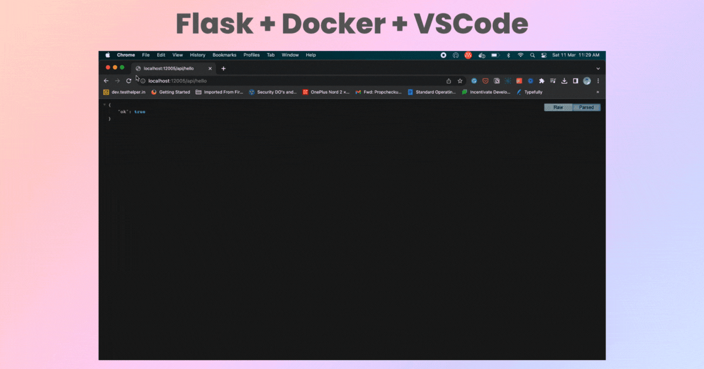

# Flask Debugging in Docker with VS Code

Debugging Flask applications inside Docker containers can be challenging, but with the right tools and configurations, it can become much easier. This repo demonstrates how to debug a Flask application running inside a Docker container using VS Code and `debugpy`.

## Prerequisites

-   Docker
-   Docker Compose
-   Visual Studio Code
-   Python Extension for VS Code

 # 🚀 Getting Started

1.  Clone this repository:
	`git clone <insert-repo-link>`
2.  Open the project in VS Code.
3.  Install the recommended extensions if prompted.
4.  Start the Docker containers using Docker Compose:
	`docker-compose up --build`
5.  Set a breakpoint in your code by clicking on the left-hand side of the line number in VS Code.
6.  In the VS Code debugger, select the "Python: Remote Attach" configuration and click the green "Play" button to start debugging.
7.  Test your Flask application and the debugger should stop at your breakpoint.

## Configuration
### Dockerfile

The `Dockerfile` is used to build the Docker image for the Flask application. The `debugpy` Python package is installed in the image to allow for remote debugging with VS Code. Additionally, the `CMD` instruction is set to start the application with `gunicorn` and `debugpy` enabled.

### docker-compose.yml

The `docker-compose.yml` file is used to define the Docker services for the Flask application and `debugpy`. The `api` service is configured to start the application with `debugpy` enabled and the necessary ports and volumes are exposed.

### .vscode/launch.json

The `.vscode/launch.json` file is used to configure the VS Code debugger. The "Python: Remote Attach" configuration is used to attach to the running Docker container and debug the Flask application.

## 🤝 Contributing
Contributions are welcome! Please open an issue or pull request if you would like to contribute to this repository.